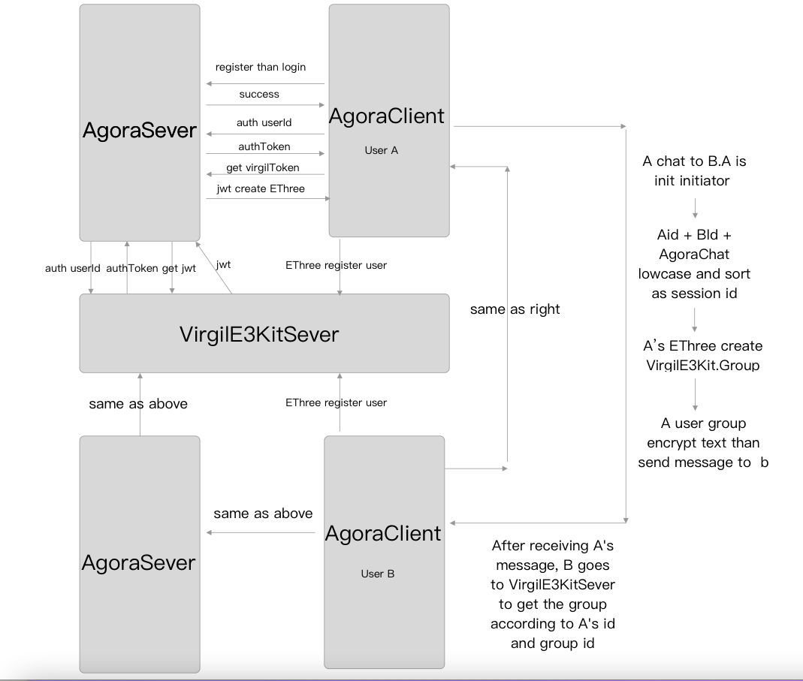

# AgoraChatEThreeExample
A chat demo based on AgoraChatSDK (basic chat) and VirgilE3Kit (encryption)

-----------------------------------------------------------------------

## Demo structure

The AgoraChatEThreeExample folder contains an AgoraChatEThreeExample project folder.Contains functions related to registration, login and logout and session list encryption session.

The AgoraChatRequest class is used to initiate network requests, and the E3EncryptoManager is used to save and create the current user's VirgilE3KitSDK object and save some information.

## What is encryption chat?

An encrypted session means that only users on both sides of the chat can see the specific content of the current message after receiving the message (the server does not know the content of the message). It protects the privacy of user chat content very well.

Process

## How to implement encrypted sessions

### We use the group encryption function of VirgilE3Kit to ensure that users can see the historical messages in the local database.

1. We use our own login and registration and then use the token generator of VirgilE3Kit to generate a jwt and then generate the VirgilE3KitSDK object according to the jwt.

2. Use this E3 object to register the current user with VirgilE3Kit.

3. Get the current user's Card object.

4. Use the E3 object to create a VirgilE3Kit.Group object based on the session creator's Card object and the sessionId(This group id is a string sorted by the id of the message sender and the message receiver plus the AgoraChat string).

5. Use the Group object to encrypt and decrypt the corresponding message.

## Using

After downloading the code, enter the AgoraChatEThreeExample folder in the terminal, and open the workspace after pod install.

`cd AgoraChatEThreeExample`

`pod install`

## Quote

> [Virgil Security document](https://developer.virgilsecurity.com/docs/e3kit/fundamentals/cryptography/)
> [Virgil Security github](https://github.com/VirgilSecurity)

## Extension

At present, this demo function supports single chat. If you want to support the group, you can replace the two parameters of the session created in the demo with the group id and the group creator.
